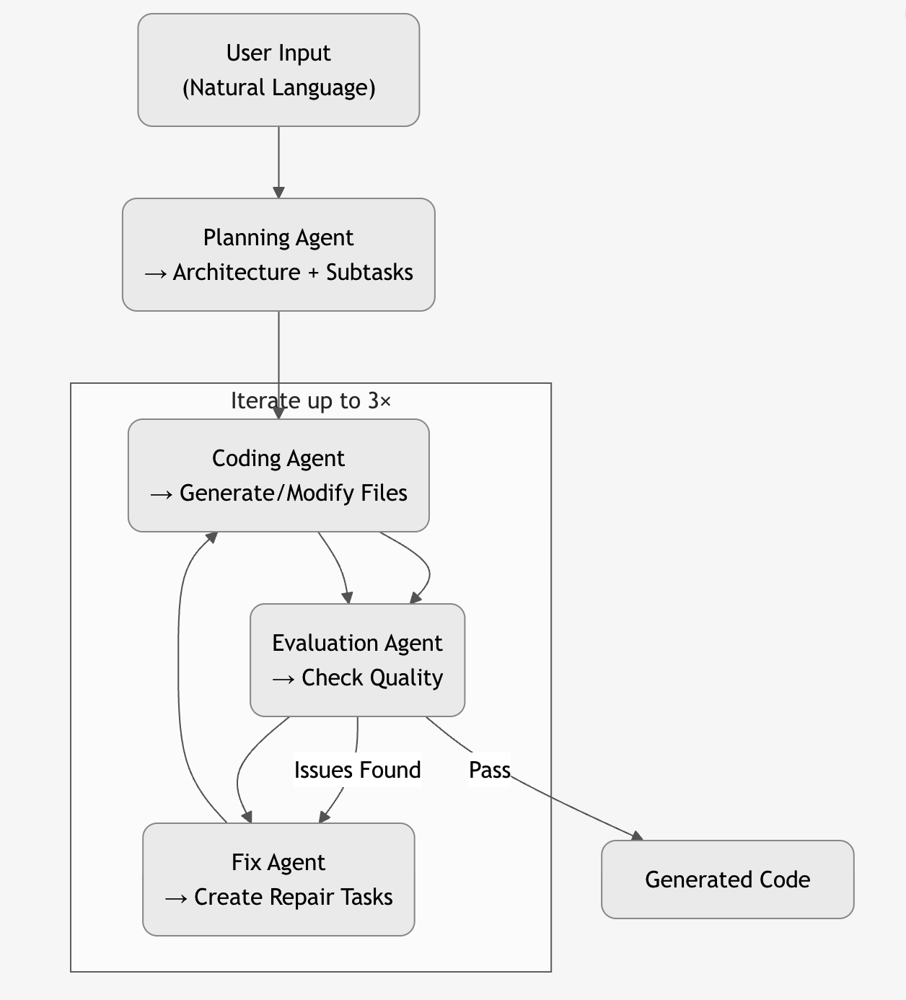

# Multi-Agent Code Generation System

**Transform natural language descriptions into fully functional web applications using a collaborative multi-agent AI pipeline.**


An intelligent system that automatically generates executable web applications from natural language prompts using a 4-agent collaborative workflow powered by LangGraph.

## Overview

This Multi-Agent Code Generation System converts natural language requirements into complete, runnable web applications with minimal human intervention. It employs a sophisticated pipeline of four specialized AI agents—Planning, Coding, Evaluation, and Fix—orchestrated via LangGraph.

The key innovation lies in its intelligent context management for multi-file projects, enabling efficient handling of complex applications while maintaining coherence across iterations. Context is intelligently compressed (90-95% reduction) during generation and expanded only when needed for repairs, allowing the system to scale to larger codebases.

Developed as a coursework project for Data Mining at The University of Hong Kong, this system demonstrates advanced applications of large language models in automated software engineering.

## Features

- Natural language to executable code transformation
- Multi-agent collaborative workflow (Planning → Coding → Evaluation → Fix)
- Automatic code quality evaluation (syntax, integration, functionality)
- Iterative refinement with up to 3 correction cycles
- Context-aware generation supporting complex, multi-file projects
- Sandboxed workspace for safe code execution and isolation

## Quick Start

### Prerequisites

- Python 3.10+ (recommended: 3.11–3.12)
- [uv](https://docs.astral.sh/uv/) package manager
- OpenAI API key (GPT-4 or compatible model)
- (Optional) Node.js for enhanced JavaScript syntax checking

### Installation

```bash
# 1. Clone the repository
git clone <your-repo-url>
cd assignment1

# 2. Install uv (if not already installed)
curl -LsSf https://astral.sh/uv/install.sh | sh

# 3. Copy and configure environment variables
cp .env.example .env
# Edit .env and add your OpenAI API key

# 4. Launch the system
./run.sh
```

### Configuration (.env)

| Variable                | Required | Description                              | Default          |
|-------------------------|----------|------------------------------------------|------------------|
| OPENAI_API_KEY          | Yes      | Your OpenAI API key                      | -                |
| OPENAI_BASE_URL         | No       | Custom API endpoint (e.g., for proxies)  | OpenAI default   |
| OPENAI_MODEL            | No       | Primary model to use                     | gpt-4            |
| PLANNING_MODEL          | No       | Model for Planning Agent                 | gpt-4            |
| CODING_MODEL            | No       | Model for Coding Agent                   | gpt-4            |
| EVALUATION_MODEL        | No       | Model for Evaluation Agent               | gpt-4            |
| FIX_MODEL               | No       | Model for Fix Agent                      | gpt-4            |
| WORKSPACE_DIR           | No       | Directory for generated code             | ./workspace      |
| LOG_LEVEL               | No       | Logging verbosity                        | INFO             |

## Usage Examples

### Example 1: Simple Calculator

**Input:**
```
Build a calculator with add, sub, mul, divide operation in purple background
```

**Output:**
Generates a responsive web calculator with:
- HTML structure (`index.html`)
- Purple-themed styling (`styles.css`)
- Interactive logic (`script.js`)

The result is a clean, functional calculator with a visually appealing interface.

### Example 2: arXiv CS Daily Webpage

**Input:**
```
Build an "arXiv CS Daily" webpage with:
1. Domain-Specific Navigation System (cs.AI, cs.TH, etc.)
2. Daily Updated Paper List with titles, timestamps, tags
3. Dedicated Paper Detail Page with PDF links, metadata, citations
```

**Output:**
A multi-page web application featuring:
- Navigation across Computer Science subfields
- Dynamic paper listings with metadata
- Individual paper detail pages
- BibTeX and standard citation export
- Clean, academic-style UI

## Architecture



**Key Components:**

- **Planning Agent**: Analyzes requirements, selects tech stack, breaks into subtasks
- **Coding Agent**: Generates and modifies files using compressed context
- **Evaluation Agent**: Performs syntax checks, integration testing, and quality review
- **Fix Agent**: Diagnoses issues and creates precise repair instructions
- **LangGraph**: Manages state, agent transitions, and workflow orchestration

## Project Structure

```
assignment1/
├── src/
│   ├── agents/           # Four specialized AI agents
│   ├── graph/            # LangGraph workflow definition
│   ├── tools/            # File operations, execution, API tools
│   ├── config/           # Configuration and environment handling
│   ├── ui/               # Rich-based terminal interface
│   ├── utils/            # Logging and helper utilities
│   └── main.py           # Application entry point
├── workspace/            # Generated project files (output)
├── logs/                 # Detailed execution logs
├── .env.example          # Template for environment variables
├── pyproject.toml        # Project dependencies (managed by uv)
├── run.sh                # Convenient launch script
└── report.md             # In-depth technical documentation
```

## How It Works

1. User enters a natural language task via the CLI
2. **Planning Agent** analyzes the request and creates 2–5 focused subtasks
3. **Coding Agent** generates files sequentially with context compression
4. **Evaluation Agent** validates syntax, integration, and overall quality
5. **Fix Agent** (if needed) analyzes failures and proposes targeted fixes
6. Steps 3–5 repeat up to 3 times for refinement
7. Final complete codebase is saved in `./workspace/`

**Context Management Innovation:**
- Reduces context size by 90–95% using intelligent summarization
- Uses summaries during normal generation, full content only for repairs
- Shared state ensures consistency across all agents

## Dependencies

- LangChain & LangGraph
- OpenAI API
- Pydantic
- python-dotenv
- Rich (for beautiful terminal UI)
- pytest, black, flake8 (development tools)

## Output

- Generated code: `./workspace/` directory
- Supported file types: HTML, CSS, JavaScript, Python, etc.
- Logs: `./logs/code-agent.log`
- Real-time feedback and final summary in terminal

## Troubleshooting

- **Missing .env**: Copy from `.env.example` and add your API key
- **Invalid API key**: Verify `OPENAI_API_KEY` in `.env`
- **uv not found**: Re-run the installation curl command
- **Generation fails**: Check detailed logs in `./logs/code-agent.log`

## Technical Details

For a deep dive into the architecture, context management strategy, performance benchmarks, and implementation details, please refer to [report.md](report.md).

## Author

**Erfei YU**  